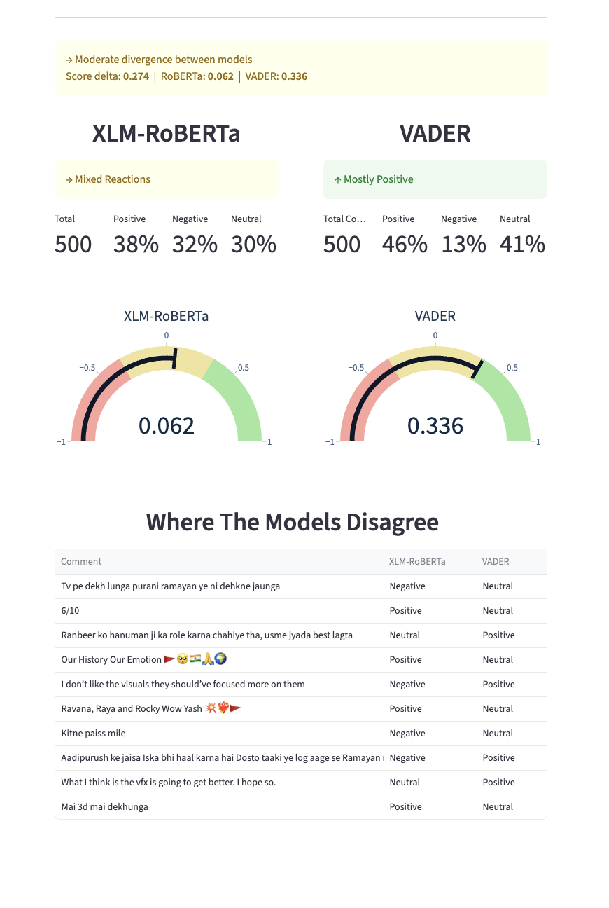

# 🎬 Hinglish Sentiment Analyzer

> Fine-tuned XLM-RoBERTa on a self-annotated 3,000+ sample Hinglish dataset, outperforming VADER baseline by 72% F1

**Live Demo** → [Streamlit App](https://hinglish-sentiment-analyzer.streamlit.app/) 
**API** → [HuggingFace Spaces](https://huggingface.co/spaces/shae2977/hinglish-sentiment-analyzer)  
**Model** → [shae2977/xlm-roberta-hinglish-sentiment-analysis](https://huggingface.co/shae2977/xlm-roberta-hinglish-sentiment-analysis)  
**Dataset** → [shae2977/hinglish-youtube-sentiment-dataset](https://huggingface.co/datasets/shae2977/hinglish-youtube-sentiments-dataset)

---

## The Problem

Most sentiment models fail on Hinglish: the code-mixed Hindi-English language used by hundreds of millions of Indians online. A comment like *"yaar ye song bahut zabardast hai"* or *"bhai kya acting, goosebumps aa gaye"* is completely opaque to English-only models like VADER.

This project fixes that.

---

---

## Results

| Model | Weighted F1 |
|---|---|
| VADER (baseline) | 0.39 |
| **XLM-RoBERTa (fine-tuned)** | **0.67** |

### Per-class breakdown

| Class | Precision | Recall | F1 |
|---|---|---|---|
| Negative | 0.66 | 0.77 | 0.71 |
| Neutral | 0.60 | 0.48 | 0.53 |
| Positive | 0.70 | 0.64 | 0.67 |

---

## Architecture

```
User → Streamlit App → FastAPI (HuggingFace Spaces, Docker) → XLM-RoBERTa
                                                             → VADER
```

- **Frontend** — Streamlit, deployed on Streamlit Community Cloud
- **Backend** — FastAPI, Dockerized and deployed on HuggingFace Spaces
- **Model** — `FacebookAI/xlm-roberta-base` fine-tuned on self-annotated Hinglish data
- **Baseline** — VADER, shown side-by-side to demonstrate the improvement

---

## Dataset

3000+ Hinglish YouTube comments scraped from Indian general entertainment content (Bollywood, music, comedy, lifestyle) and manually annotated using Label Studio 
| Class | Count | Percentage |
|---|---|---|
| Negative | 1,427 | 44.73% |
| Neutral | 770 | 24.14% |
| Positive | 993 | 31.13% |

---

## Training

| Hyperparameter | Value |
|---|---|
| Base model | `FacebookAI/xlm-roberta-base` |
| Learning rate | 1e-5 |
| Batch size | 16 |
| Max sequence length | 128 |
| Optimizer | AdamW |
| Epochs | 5 |
| Hardware | NVIDIA T4 (Google Colab) |

---

## Project Structure

```
hinglish-sentiment-analyzer/
├── api/
│   ├── main.py              # FastAPI app
│   └── requirements.txt     # API dependencies
├── app/
│   └── streamlit_app.py     # Streamlit frontend
├── data/
│   ├── scraper.py           # YouTube comment scraper
│   └── ollama_filter.py     # Comment filtering
├── Dockerfile               # For HuggingFace Spaces deployment
├── requirements.txt         # Full project dependencies
└── README.md
```

---

## API

**Base URL:** `https://shae2977-hinglish-sentiment-analyzer.hf.space`

### `GET /`
Health check. Returns `{"message": "Server is running!"}`.

### `POST /predict` 
Accepts a batch of comments, returns XLM-RoBERTa and VADER predictions side by side

---

## Local Setup

```bash
git clone https://github.com/shaizaiqubal/hinglish-sentiment-analyzer
cd hinglish-sentiment-analyzer
python -m venv venv
source venv/bin/activate
pip install -r requirements.txt
```

Create a `.env` file:
```
HF_TOKEN=your_huggingface_token
API_URL=http://localhost:8000
```

Run the API:
```bash
cd api
uvicorn main:app --reload
```

Run the Streamlit app:
```bash
streamlit run app/streamlit_app.py
```

---

## Limitations

- Overall F1 of 0.67 reflects the difficulty of Hinglish sentiment and the limited dataset size. More annotated data would improve performance
- Neutral class is the weakest (F1: 0.53), neutral comments are ambigous and difficult of annotate accurately
- Domain is limited to Indian entertainment content and may not generalize to sports, news, or politics

---
